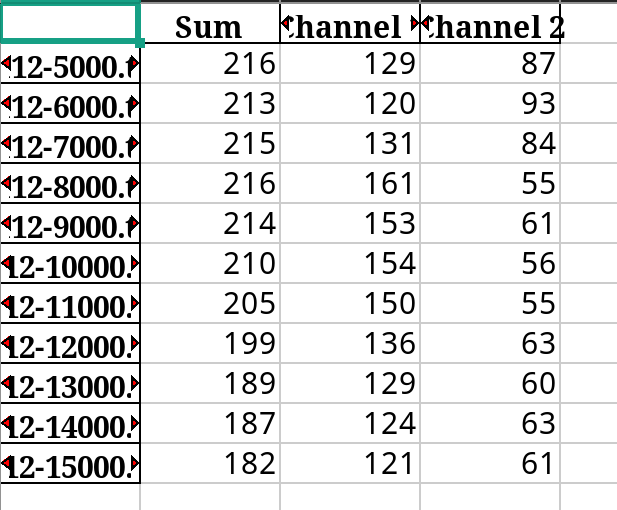

# 沉淀析出晶相计数

此项目用于计算机生成的沉淀析出晶相的自动检测与计数

## 案例展示

使用方法
```shell
python /path/to/main.py /path/to/data_path
```

默认使用案例数据进行演示

``` shell
python main.py
```

输出 output.xlsx， 如图



## 依赖安装

```shell
pip install -r requirements.txt 
```

如果网速过慢，使用清华源(或其他国内镜像)

``` shell
pip install -i https://pypi.tuna.tsinghua.edu.cn/simple -r requirements.txt
```

## 代码补充说明

沉淀析出的晶粒为梭形, 且存在相互重叠.
本项目的处理思路为

1. 提取晶粒区域(region)，一个region中只能包含一个晶粒或多个重叠的晶粒。
2. 对包含不同晶粒个数的晶粒返回对应的晶粒数
3. 将所有region中的晶粒数量加和.

步骤1的实现通过二值化+预处理+连通域检测实现，与晶粒计数雷同,不做多余介绍。

步骤2为本项目的难点。

### 步骤二

---

分析：region中包含两种信息，灰度信息和轮廓信息，轮廓信息是灰度信息在空间上的分布的二阶导数。

于是有两种实现思路

1. 将region均分为许多小份，计算相邻小份之间的相似度（通过灰度和轮廓）进行合并，不断迭代，知道所有的合并完成位置，此时剩下所有小份各对应1个晶粒

2. 将region上的晶粒进行细化，梭形晶粒被转换为直线，再通过霍夫转换统计直线的数量。

由于法二更加直观，因此本项目采取的法二进行实现。但是在实现过程中许多不足暴露了出来，下面分析本项目使用的法二。如果需要进行项目优化，优先考虑使用法一或其他方法进行重构，因为法二的许多不足无法弥补

### 法二

---

1. 通过骨架算法细化晶粒(Skeletonize)(Convert_lines)
2. 拆分骨架，优化霍夫转换的效果。(SearchLines)(Convert_lines)
3. 进行霍夫转换。(HoughTransform)(Count_line)
4. 对霍夫转换的结果进行近似统计

---

### 其他补充说明

上节步骤二的作用在于减少霍夫转换的错误投票，霍夫转换对于误差波动较为敏感。同时进行转换的直线越少，准确率越高。

上节步骤四的作用在于提高霍夫转换的容错率，由于霍夫转换很敏感，需要将近似的直线归类为同一条直线进行统计


